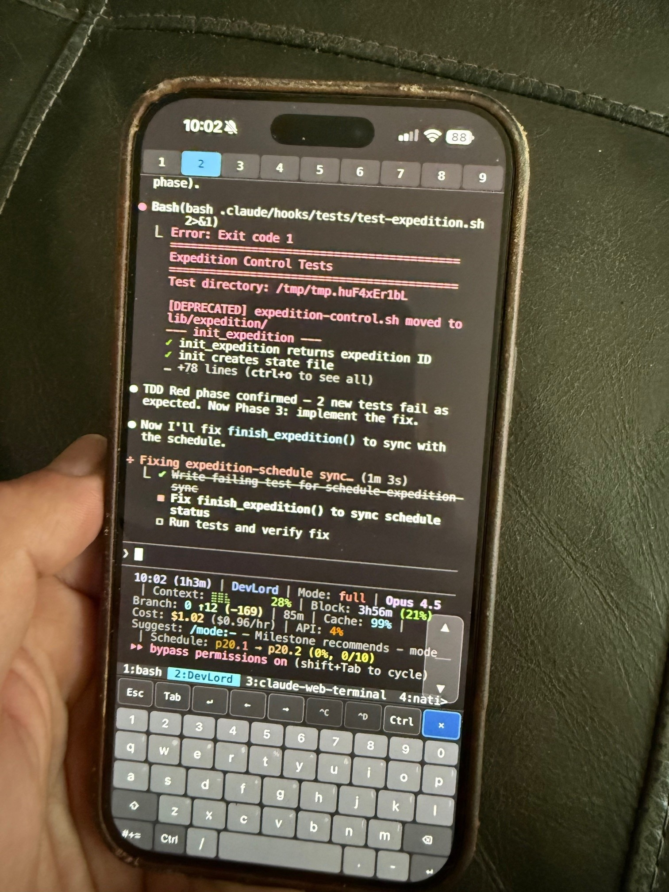

# Claude Code Web Terminal

<p align="center">
  
</p>

Run Claude Code from any device — your phone, tablet, or any laptop — through a purpose-built terminal interface that works entirely in the browser. No app to install, no SSH client to configure, no compromises on usability.

Start a Claude session from your desk, continue it from your phone on the couch, then pick it up on your laptop. Every device shares the same live session. Disconnects don't lose your work — sessions persist through network changes, browser closes, and even reboots.

## Why This Exists

Claude Code is a command-line tool. That's powerful, but it ties you to whatever machine it's running on. This project breaks that constraint by serving your terminal sessions over an encrypted Tailscale VPN connection, accessible from any browser.

The hard part isn't putting a terminal in a browser — it's making it actually usable across different devices. A phone screen is not a desktop monitor. Touch is not a mouse. An on-screen keyboard is not a physical one. This project addresses each of those gaps with a custom-built interface layer on top of xterm.js.

## Features

- **Any device, same session** — Phone, tablet, laptop, desktop. Start on one, continue on another. Every device sees the same live terminal state.
- **Persistent sessions** — Close the browser, lose WiFi, reboot your machine. Your Claude sessions survive it all. The service auto-starts on boot.
- **Multi-project workflows** — Run up to 9 Claude sessions simultaneously in tmux windows. Switch between them with a tap or keystroke.
- **One-click session launcher** — Select projects from a fuzzy-search picker. Already-open projects switch to the existing window instead of creating duplicates.
- **Installable as an app** — Add to Home Screen on iOS/Android for a native app experience with custom icon and full-screen display (PWA).
- **Protected by Tailscale** — Your terminal is never exposed to the public internet. All traffic is encrypted end-to-end through Tailscale's peer-to-peer VPN. Only devices signed into your personal Tailscale network can connect.
- **Upgrade-safe** — User settings (launch command, projects directory, sudo preference) are preserved across upgrades, with the option to change them. Sudo can be permanently locked off to skip the prompt on future upgrades.
- **Cross-platform** — Runs on macOS, Linux, and Windows (WSL2). One-command install on each.

## Platform Compatibility

| Platform | Host Status | Client (Browser) |
|----------|-------------|-------------------|
| **macOS 13+** | Supported (in testing) | Any browser |
| **Linux (Ubuntu 20.04+, Debian 10+)** | Fully supported | Any browser |
| **Windows (WSL2)** | Fully supported | Any browser |
| **iOS / Android** | Client only | Safari, Chrome (Add to Home Screen for PWA) |

The server runs on macOS, Linux, or WSL2. The client is any browser on any device — phone, tablet, laptop, desktop. All clients connect to the same live tmux session.

> **Note:** macOS support is in testing. Please [report any issues](https://github.com/lhymes/claude-web-terminal/issues) for quick resolution.

## Mobile-First Design

The terminal interface was designed from the ground up for touch devices. Every UI element meets minimum 44px touch targets, and the entire layout adapts to screen size.

### What Mobile Users Get

**Input bubble** — A floating composition area at the bottom of the screen. Tap the pill to expand it, type or dictate your message using the native iOS/Android keyboard (with autocorrect, predictive text, and dictation support), then tap **Send** to paste the text into the terminal. Press **Enter** to send, **Shift+Enter** for a newline. The bubble isolates your typing from terminal output, so Claude can churn without interfering with your input. Tap the minimize button to collapse it back to a pill showing a preview of your text. Two small **Esc** and **Enter** tabs protrude from the top-right of the bubble for quick access without expanding it.

**Single-finger scroll** — Swipe up or down on the terminal to scroll through history, just like scrolling a web page. The terminal is read-only on mobile — tapping it does not open a keyboard.

**Shortcut bar** — A persistent toolbar at the bottom with two switchable modes. **Keys mode** (default): Tab, arrow keys (all four directions with repeat-on-hold), ^C (interrupt), + (new session), and tab navigation arrows (◀ ▶). **Tabs mode**: numbered buttons 1-9 for direct session switching with active tab highlighting. Tap the **⌨** button (rightmost) to toggle between modes.

**Touch-optimized viewport** — The layout locks to the screen size. No accidental zooming, no page bounce, no address bar interference. The terminal fills exactly the available space, reflowing when the on-screen keyboard opens or closes.

### Desktop Experience

On screens 769px and wider, the mobile UI is hidden and replaced with a desktop-optimized experience:

**Scroll / Select toggle** — By default, text selection and copy/paste work natively in the browser. Click the mode icon in the toolbar to enable scroll-wheel navigation through terminal history. Click again to switch back to text selection mode. The icon changes between a monitor (select) and mouse (scroll) to indicate the current mode.

**Copy/paste shortcuts** — Ctrl+Shift+C and Ctrl+Shift+V for clipboard operations. Ctrl+C also copies when text is selected (sends interrupt only when nothing is selected). These work in select mode.

**Floating toolbar** — A compact overlay in the bottom-right corner with:
- **Mode toggle** icon to switch between text selection and scroll-wheel navigation
- **Tab: + New** button to launch the project picker (switches to window 1, clears the screen, runs `cl`)
- Clickable tab buttons (1-9) to switch tmux windows with active tab highlighting
- **Collapse arrow** to minimize the toolbar to four small buttons: mode toggle, + new, previous tab, and next tab — useful when tmux tab names overlap the toolbar

**Responsive font sizing** — Terminal font scales based on viewport width for consistent readability across screen sizes.

## Quick Install

### About Tailscale

Tailscale creates the private encrypted network that makes your terminal accessible from any device — phone, tablet, laptop — without exposing anything to the public internet. Each platform's install steps below include Tailscale setup. You'll also need to install Tailscale on every **client device** you want to connect from:

- **iOS / Android:** Install from the App Store or Play Store
- **Other laptops/desktops:** [tailscale.com/download](https://tailscale.com/download)

**Sign in with the same Tailscale account on every device.**

### Install (choose your platform)

#### Windows (WSL2)

```powershell
# In PowerShell as Administrator (if WSL not installed)
wsl --install -d Ubuntu
```

Then inside your Ubuntu WSL terminal:

```bash
# Verify systemd is enabled in /etc/wsl.conf:
#   [boot]
#   systemd=true

# Install Tailscale (required — protects your terminal from outside access)
curl -fsSL https://tailscale.com/install.sh | sh && sudo tailscale up

# Install dependencies
sudo apt-get install -y tmux fzf
# ttyd: install from https://github.com/tsl0922/ttyd/releases (need 1.7.4+)

# Install Claude Code
curl -fsSL https://claude.ai/install.sh | sh

# Clone and install
git clone https://github.com/lhymes/claude-web-terminal.git
cd claude-web-terminal
sudo ./install-local.sh

# Start and expose via Tailscale
sudo systemctl start claude-terminal
tailscale serve --bg 7681
```

#### Linux (Ubuntu/Debian)

```bash
# Install Tailscale (required — protects your terminal from outside access)
curl -fsSL https://tailscale.com/install.sh | sh && sudo tailscale up

# Install dependencies
sudo apt-get install -y tmux fzf
# ttyd: install from https://github.com/tsl0922/ttyd/releases (need 1.7.4+)

# Install Claude Code
curl -fsSL https://claude.ai/install.sh | sh

# Clone and install
git clone https://github.com/lhymes/claude-web-terminal.git
cd claude-web-terminal
sudo ./install-local.sh

# Start and expose via Tailscale
sudo systemctl start claude-terminal
tailscale serve --bg 7681
```

#### macOS

```bash
# Install Tailscale (required — protects your terminal from outside access)
# Download from https://tailscale.com/download and sign in

# Install dependencies
brew install ttyd tmux fzf

# Install Claude Code (if not already installed)
brew install --cask claude-code

# Clone and install
git clone https://github.com/lhymes/claude-web-terminal.git
cd claude-web-terminal
./install-mac.sh

# Start and expose via Tailscale
launchctl load ~/Library/LaunchAgents/com.claude-terminal.ttyd.plist
tailscale serve --bg 7681
```

> macOS support is in testing. Please [report any issues](https://github.com/lhymes/claude-web-terminal/issues) for quick resolution.

### Open

Open `http://localhost:7681` (local) or your Tailscale URL (remote). Get your URL with `tailscale serve status`.

On your phone: open the URL in Safari/Chrome, then **Add to Home Screen** for a native app experience.

### Installer Options

All installers prompt you to configure:
- **Claude command** — The command to launch Claude Code (default: `claude`)
- **Projects directory** — Where your projects live (default: `~/projects`)
- **Remote sudo** — Optionally enable passwordless sudo (see Security section). Can be permanently locked off to skip the prompt on future upgrades.

Settings are saved to `~/.config/claude-terminal/settings.conf`.

## Upgrading

Pull the latest code and re-run the installer for your platform:

```bash
cd claude-web-terminal
git pull

# Linux / WSL
sudo ./install-local.sh
sudo systemctl restart claude-terminal

# macOS
./install-mac.sh
launchctl unload ~/Library/LaunchAgents/com.claude-terminal.ttyd.plist
launchctl load ~/Library/LaunchAgents/com.claude-terminal.ttyd.plist
```

On upgrade, the installer shows your current settings and offers to change them. Press Enter to keep everything as-is, or choose to modify your launch command, projects directory, or sudo access.

## Uninstalling

```bash
# Linux / WSL
sudo ./install-local.sh --uninstall

# macOS
./install-mac.sh --uninstall
```

This prompts for two confirmations before removing services, scripts, configuration, sudoers entries, and shell aliases. Your project files are not touched.

## Configuration

User settings are stored in `~/.config/claude-terminal/settings.conf`:

```bash
CLAUDE_CMD="claude"                    # Command to launch Claude Code
CLAUDE_PROJECTS_DIR="$HOME/projects"   # Where projects are stored
REMOTE_SUDO="no"                       # Passwordless sudo (yes/no)
REMOTE_SUDO_LOCKED="no"               # Lock sudo off permanently (yes/no)
```

Edit this file directly to change settings. Changes take effect on next shell login (or run `source ~/.bashrc`). You can also change settings by re-running `sudo ./install-local.sh`.

When `REMOTE_SUDO_LOCKED` is set to `yes`, the installer skips the sudo prompt on upgrades. To re-enable sudo after locking it off, uninstall and reinstall.

## Daily Usage

### Launch Projects

1. Open `http://localhost:7681` (or your Tailscale URL)
2. Type `cl` in the terminal (or click **+ New** on desktop, or tap **+** on mobile)
3. Select projects with arrow keys, **Tab** to multi-select, **Enter** to launch

If a selected project is already open in another tmux window, the launcher switches to it instead of creating a duplicate.

### Switch Between Sessions

- **Keyboard:** `Alt+1` through `Alt+9`
- **Mobile:** Tap **⌨** in the shortcut bar to switch to tabs mode, then tap numbered buttons 1-9
- **Desktop:** Click tab buttons in the floating toolbar (bottom-right corner)

### Commands

| Command | Description |
|---------|-------------|
| `cl` | Interactive project picker (fzf) |
| `clp <project>` | Quick-launch specific project |
| `cnew <project>` | Create new project + launch |
| `cls` | Check service status and active sessions |
| `tj` | Attach to tmux session from another terminal |

## Mobile Setup

1. Install **Tailscale** app on your phone
2. Sign in to your tailnet
3. Open your terminal URL (get it with `tailscale serve status`)
4. Safari: Share > Add to Home Screen (launches as a standalone app with custom icon)

### Mobile Tips

- Tap the **input bubble** pill to start typing or dictating
- **Enter** sends your text; **Shift+Enter** adds a newline
- Use **Esc** and **Enter** tabs on the bubble for quick key presses without expanding
- Swipe the terminal to scroll through history
- Use **arrow keys** in the shortcut bar to navigate menus (hold for repeat)
- Use **^C** in the shortcut bar to interrupt Claude
- Tap **+** in the shortcut bar to start a new session
- Tap **⌨** to switch the shortcut bar to session tabs (1-9), tap again to switch back
- Use **tab arrows** (◀ ▶) in keys mode to cycle through sessions
- Exit Claude with `/exit` when you need shell access

## Session Persistence

| Event | Sessions Survive? |
|-------|-------------------|
| Close browser | Yes |
| Switch devices | Yes |
| Network disconnect | Yes |
| WSL/Windows reboot | Service auto-starts; run `cl` to relaunch projects |

The systemd service auto-starts ttyd + tmux on boot. A healthcheck timer runs every 30 seconds to restart the service if ttyd dies.

## Security

Tailscale protects your terminal connection from outside access. All traffic is encrypted end-to-end through Tailscale's peer-to-peer VPN — no data passes through a central server, and nothing is exposed to the public internet. Only devices signed into your personal Tailscale network (your "tailnet") can reach the terminal. Unauthorized users cannot connect, even if they know your machine's IP address.

**Remote sudo** is an optional feature that enables passwordless sudo in the web terminal. It can be enabled or disabled during install/upgrade. When declining sudo, the installer offers to lock the setting permanently so future upgrades skip the prompt entirely (uninstall and reinstall to change a locked setting). You can also configure sudo manually:

```bash
# Enable
echo "$USER ALL=(ALL) NOPASSWD: ALL" | sudo tee /etc/sudoers.d/claude-terminal
sudo chmod 440 /etc/sudoers.d/claude-terminal

# Disable
sudo rm /etc/sudoers.d/claude-terminal
```

**If you enable remote sudo:** anyone with access to your terminal session has root access. Only use this with Tailscale VPN. Never expose ttyd directly to the internet or local network. Your device security (screen lock, passwords) is your last line of defense.

**Service hardening:** When remote sudo is disabled, the systemd service runs with `NoNewPrivileges=true` to prevent privilege escalation. When sudo is enabled, this restriction is removed so `sudo` can function correctly.

## Upgrading from Zellij Version

If you previously installed the Zellij-based version:

```bash
# See what's installed (no changes)
sudo ./upgrade.sh --detect

# Upgrade: removes old Zellij components, installs new tmux version
sudo ./upgrade.sh

# Or just remove everything without reinstalling
sudo ./upgrade.sh --clean
```

The upgrade preserves your projects in `~/projects`.

## Troubleshooting

### Service won't start
```bash
cls                                       # Check status
sudo journalctl -u claude-terminal -n 30  # View logs
```

### Stale session
```bash
tmux kill-session -t claude
sudo systemctl restart claude-terminal
```

### Port in use
```bash
sudo lsof -i :7681
sudo kill <PID>
sudo systemctl restart claude-terminal
```

### Can't connect remotely
```bash
tailscale status        # Is Tailscale running?
tailscale serve status  # Is serve configured?
```

## Architecture

```
Browser (any device)
       |
Tailscale VPN (encrypted peer-to-peer)
       |
ttyd (web terminal server, port 7681)
       |
Custom xterm.js frontend (adaptive mobile/desktop UI)
       |
tmux session "claude" (multiplexed windows)
       |
Claude Code CLI (per-project windows)
```

All devices connect to the same tmux session — you see identical state everywhere.

## Files

```
claude-web-terminal/
├── html/
│   ├── index.html       # Custom frontend (xterm.js + adaptive touch/desktop UI)
│   ├── icon.svg         # App icon for PWA / home screen
│   └── manifest.json    # Web app manifest
├── install-local.sh     # Linux / WSL installer
├── install-mac.sh       # macOS installer (in testing)
├── upgrade.sh           # Upgrade from Zellij version
├── README.md            # This file
├── QUICK-REFERENCE.md   # Printable cheat sheet
└── LICENSE              # MIT
```

## Author

Created by **Larry Hymes** — [Hymes Consulting](https://www.hymesconsulting.com)

## Credits

- [ttyd](https://github.com/tsl0922/ttyd) — Terminal over web
- [tmux](https://github.com/tmux/tmux) — Terminal multiplexer
- [xterm.js](https://xtermjs.org/) — Browser-side terminal emulator
- [Tailscale](https://tailscale.com/) — Secure networking
- [fzf](https://github.com/junegunn/fzf) — Fuzzy finder

## License

MIT
